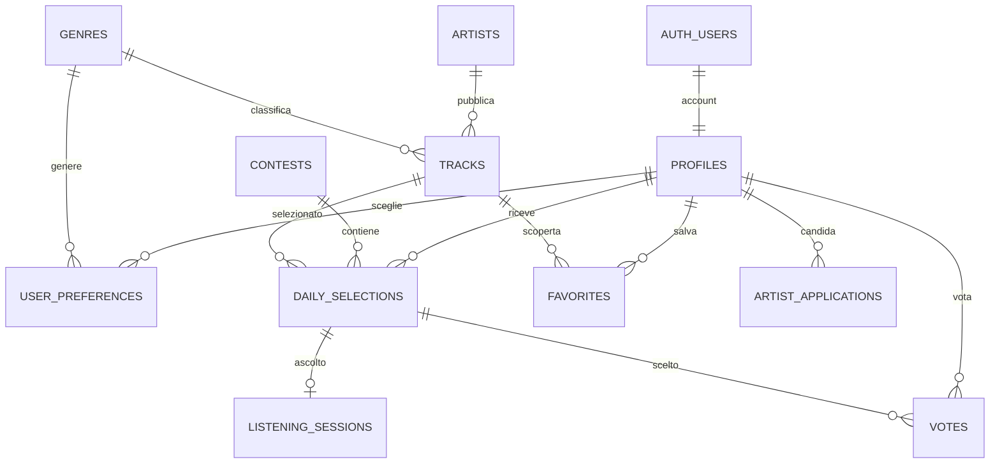

# Supabase e Vercel

## Stato del progetto

L’app supporta due modalità esplicite:

- `supabase`: account reali con email/password, dati condivisi e regole del contest nel database.
- `demo`: esperienza locale precedente, utile per sviluppare senza account.

Il file `.env.local`, ignorato da Git, contiene URL e chiave pubblica del progetto configurato dall’utente. Non contiene password del database, service_role o chiavi segrete. In produzione, l’assenza di configurazione Supabase provoca un messaggio visibile: non viene avviata silenziosamente una demo.

Il 5 ottobre 2026 l’utente ha eseguito `supabase/setup-demo.sql` nel SQL Editor e riportato `Success`. La verifica remota in sola lettura ha confermato i 15 generi, l’assenza di accesso anonimo alle tabelle personali e la presenza della RPC protetta `get_dashboard`. Non sono stati creati account di test nel progetto remoto. Login e scritture reali vanno provati con un account dell’utente dopo la configurazione dei redirect Auth.

## Schema

| Schema     | Tabella             | Scopo                                                     |
| ---------- | ------------------- | --------------------------------------------------------- |
| public     | genres              | 15 generi condivisi                                       |
| public     | profiles            | Nome, tema, onboarding; collegamento a Supabase Auth      |
| public     | user_preferences    | Generi scelti dall’utente                                 |
| public     | artist_applications | Candidature con diritti dichiarati e stato di verifica    |
| vp_private | artists             | Identità e verifica di idoneità                           |
| vp_private | tracks              | Brani, audio autorizzati, durata e stato di approvazione  |
| vp_private | contests            | Giorno di Roma e chiusura alle 21:00                      |
| vp_private | daily_selections    | Cinque slot per utente/giorno, con identificativi casuali |
| vp_private | listening_sessions  | Sessioni di ascolto e avanzamento verificato              |
| vp_private | votes               | Un voto per account/giorno                                |
| vp_private | favorites           | Scoperte salvate dopo il reveal                           |
| vp_private | reveal_views        | Reveal già visti                                          |



## Sicurezza e regole

RLS è abilitata su tutte le tabelle. I client pubblici possono leggere soltanto i generi. Gli utenti autenticati possono leggere il proprio profilo, le proprie preferenze e candidature. Scritture e accesso al ledger del contest passano attraverso RPC: non esiste un permesso del client per modificare direttamente completamenti, stato di candidatura, selezioni o voti.

Lo schema `vp_private` non va aggiunto agli schemi esposti nelle impostazioni Data API. Le RPC che lo raggiungono hanno `search_path` vuoto, oggetti qualificati, verifica obbligatoria di `auth.uid()` e permessi EXECUTE limitati ad `authenticated`. Non serve service_role nel frontend né una funzione Vercel con credenziali amministrative per queste operazioni.

Le selezioni vengono create sul server e conservate. Le richieste simultanee dello stesso account sono serializzate con lock di riga; il vincolo unico sul voto protegge anche richieste concorrenti da dispositivi diversi. La chiusura usa l’orologio PostgreSQL e `Europe/Rome`, compresa l’ora legale. Nome, artista e link Spotify sono restituiti soltanto dopo il reveal; il browser riceve identificativi dello slot diversi da quelli del catalogo privato.

Prima di riprodurre un audio, il server verifica che gli slot precedenti siano completati. Il client invia avanzamento circa ogni tre secondi; il server limita il credito al tempo trascorso e all’avanzamento continuo. Solo il completamento confermato dal database sblocca il brano seguente. Una nuova sessione invalida la precedente dello stesso account; una sessione scade dopo un’ora o al cambio giorno. Un ricaricamento richiede di ricominciare il brano parziale.

Il protocollo impedisce la conferma istantanea e il salto alla fine; non prova che una persona stia ascoltando e un client modificato può simulare avanzamenti in tempo reale. Per un contest pubblico occorreranno anche misure antiabuso, limiti per account e monitoraggio. Interruzioni di rete o heartbeat mancanti possono richiedere di ricominciare il brano: l’app mostra l’errore e non salva falsi progressi.

Gli audio demo sono pubblici e sintetici. Per brani reali servono storage privato, URL firmati a breve durata rilasciati da una funzione server dopo autorizzazione, file completi, metadati audio rimossi e verifica dei diritti. Una URL pubblica in `tracks.audio_path` non garantisce protezione del file o dell’identità. Non caricare token Spotify nelle tabelle esposte o nel bundle; l’integrazione Spotify non è ancora implementata.

## Migrazioni e dati iniziali

Le migrazioni sono la fonte dello schema:

1. `20261005000100_initial_schema.sql`: tabelle, vincoli, RLS e trigger Auth.
2. `20261005000200_reference_data.sql`: generi e profili per utenti già presenti.
3. `20261005000300_contest_api.sql`: funzioni di profilo e contest.
4. `20261005000400_bound_session_credit.sql`: limite cumulativo al credito di ascolto, anche con richieste ravvicinate.

```sh
npm run db:bundle
npm run db:test
npm run db:check
```

Il primo comando genera due script atomici per un progetto **vuoto**:

- `supabase/setup.sql`: schema e generi, senza brani dimostrativi.
- `supabase/setup-demo.sql`: schema, generi e catalogo demo.

**Non rieseguire questi setup sul database già inizializzato.** Lo script iniziale eseguito in questa sessione conteneva le prime tre migrazioni; la quarta è stata applicata separatamente con `supabase/update-session-credit.sql`, con Success riportato dall’utente. I setup generati ora includono tutte e quattro le migrazioni per nuovi progetti vuoti. Entrambi scrivono anche lo storico `supabase_migrations.schema_migrations`, compatibile con la successiva gestione CLI. Un secondo setup fallisce senza alterare lo schema, grazie alla transazione.

Il catalogo demo è in `supabase/seeds/demo.sql` ed è ripetibile: 75 artisti inventati, 75 candidati, cinque WAV sintetici da 12 secondi, marcati `is_demo`. Non inserisce account, voti, esposizioni o ascolti fittizi. Le classifiche cloud partono dalle esposizioni e dai voti realmente registrati. L’app segnala cataloghi insufficienti invece di generare candidati nel browser.

`supabase/seed.sql` contiene gli stessi dati per lo stack locale Supabase. Per ambiente reale, `supabase db push` applica soltanto le migrazioni; non aggiungere `--include-seed` se non vuoi i dati demo. Il generatore del bundle è un’operazione locale: non cambia il database remoto.

Per le prossime modifiche aggiungere una **nuova** migrazione; non riscrivere quelle già applicate. Effettuare prima test locali e una verifica del piano:

```sh
npx supabase login
npm run db:link
npx supabase db push --dry-run
npm run db:push
```

L’accesso amministrativo e la password vanno inseriti nei prompt della CLI sul proprio computer; non nel sorgente o nella chat. Prima di applicare nuove migrazioni a un database con dati, prevedere backup e una procedura di ripristino. Non usare `db reset --linked` sul progetto remoto.

`npm run db:test` esegue le migrazioni su PostgreSQL tramite PGlite, con ruoli e helper Auth simulati. Verifica sintassi, seed ripetibile, isolamento utenti, permessi, ordine di ascolto, credito temporale, unicità dei voti, reveal, candidature e preferiti. Non sostituisce una prova end-to-end con Supabase Auth reale.

Per lo stack Supabase locale completo serve Docker Desktop avviato, poi `npm run db:start`. Alla preparazione di questo progetto Docker era installato ma il motore non risultava avviato; i test PostgreSQL non lo richiedono.

## Configurazione Vercel

`vercel.json` imposta Vite, `npm ci`, `npm run build` e output `dist`.

In **Vercel → Project → Settings → Environment Variables**, impostare per gli ambienti desiderati:

| Variabile                     | Valore                                                      |
| ----------------------------- | ----------------------------------------------------------- |
| VITE_DATA_MODE                | supabase                                                    |
| VITE_SUPABASE_URL             | URL del progetto Supabase già configurato in `.env.local`   |
| VITE_SUPABASE_PUBLISHABLE_KEY | Chiave pubblica publishable già configurata in `.env.local` |

La chiave pubblica viene inclusa nel browser: è previsto dal modello Supabase, e i dati sono protetti da ACL/RLS. Non impostare service_role o password con prefisso `VITE_`. Le variabili Vite sono lette durante la build: eseguire un **nuovo deploy** dopo averle impostate.

In **Supabase → Authentication → URL Configuration**, usare come Site URL l’URL HTTPS della produzione Vercel. Aggiungere gli URL esatti ammessi per i redirect, incluso `http://127.0.0.1:4173` per lo sviluppo. Tenere attiva la conferma email; la schermata di registrazione invita a confermare prima del login. Le preview Vercel vanno aggiunte soltanto se usate per provare l’autenticazione.

La configurazione Vercel e i redirect Auth sul dashboard restano operazioni dell’utente: non sono stati modificati da questa sessione.

## Primo collaudo reale

1. Avviare l’app con `npm start`, oppure il deploy Vercel aggiornato.
2. Registrare il proprio account e confermare l’email.
3. Scegliere i generi e verificare il proprio profilo su Supabase.
4. Completare i cinque audio in ordine; verificare pausa/ripresa e blocco degli slot successivi.
5. Prima delle 21:00, confermare un solo voto. Aprire lo stesso account su un secondo dispositivo e verificare che il voto sia condiviso.
6. Dopo il reveal verificare identità, classifica e preferiti. In cloud non è disponibile un reveal di prova anticipato.
7. Inviare una candidatura e verificare `pending`; non deve comparire automaticamente nel catalogo.

I dati localStorage della vecchia demo non vengono importati automaticamente come ascolti o voti verificati. Gli account reali iniziano con il proprio stato Supabase.

## Riferimenti ufficiali

- [Supabase Auth con React](https://supabase.com/docs/guides/auth/quickstarts/react)
- [Row Level Security](https://supabase.com/docs/guides/database/postgres/row-level-security)
- [Database Functions](https://supabase.com/docs/guides/database/functions)
- [Database Migrations](https://supabase.com/docs/guides/deployment/database-migrations)
- [Seeding](https://supabase.com/docs/guides/local-development/seeding-your-database)
